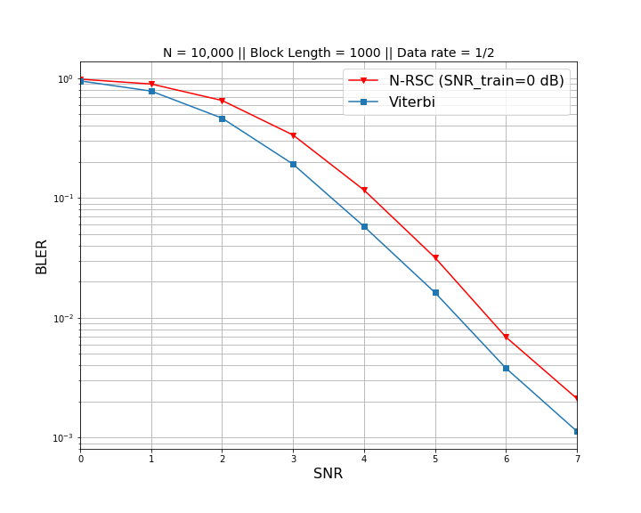

# THIS IS NOT AN OFFICIAL IMPLEMENTATION

This repository is an implmentation of "*Communication Algorithms via Deep Learning*". Paper: https://arxiv.org/abs/1805.09317.

This paper claims that a Recurrent Neural Network can **learn from data to decode** noisy coded signal over Additive White Gaussian Noise (AWGN) Channel **as good as** Viterbi and BCJR algorithm. 

Block Length = 1000         |  Block Length = 1000 
:-------------------------:|:-------------------------:
| 

## Network Architecture:

[IMAGE]

* **Why Bi-directional, and not uni-directional, RNN?** Similar to dynamic programming, it usually consists of a forward and backward steps. The Bi-directional RNN architecture allows the network to learn the feature representation in both ways.

* **Proper training data matters.** In addition, the paper provides an emperical method to determine the Signal-to-Noise (SNR) for generating training dataset. Recall that noisy data can be generated at various training

## How to reproduce the result - Step by Step
---

## Result
---
This repository validates that, indeed, an RNN can learn to decode convolution coded signals over AWGN Channel. Moreover, this RNN can generalize well to decode at different Signal To Noise (SNR) values as good as Viterbi Algorithm Decoder. We use `Bit Error Rate` (BER) and `Block Error Rate` (BLER).

## Steps to reproduce result
